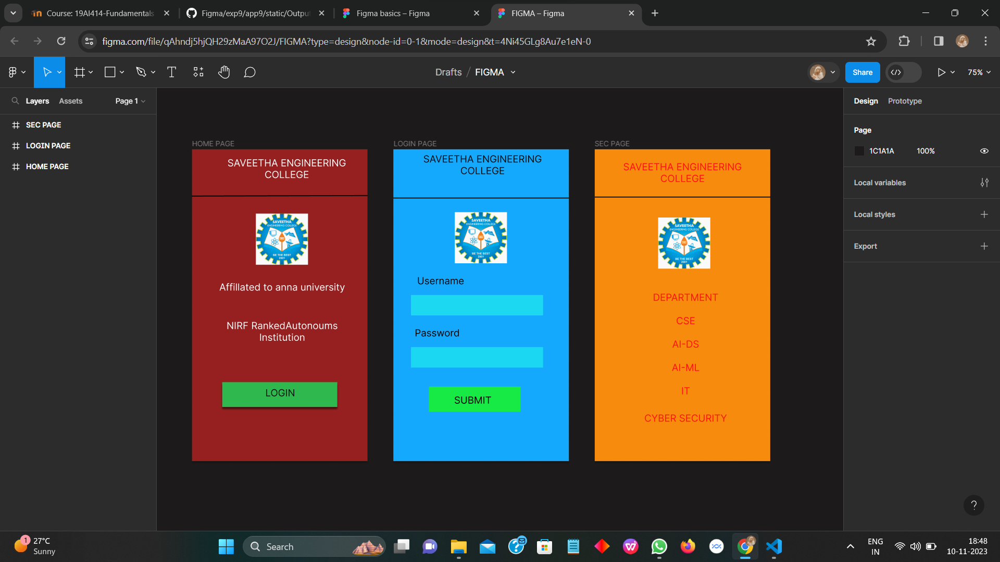

# Ex09 Event Registration Web Application
## Date:14.11.2023

## AIM:
To design, develop and deploy a web application for event registration.

## DESIGN STEPS:

### Step 1:
Create a new frame.

### Step 2:
Select any one preset size of your choice.

### Step 3:
Select the shapes you need.

### Step 4:
Import images as needed.

### Step 5:
Create pages based on your need and link them.

### Step 6:

Validate the HTML and CSS code.

### Step 6:

Publish the website in the given URL.

## DESIGN TOOL:
Figma

## CODE:
```

/* HOME PAGE */

position: relative;
width: 360px;
height: 640px;
background: rgba(194, 32, 32, 0.73);
box-shadow: 0px 4px 4px rgba(0, 0, 0, 0.25);
/* Affillated to anna university */
position: absolute;
width: 278px;
height: 30px;
left: 46px;
top: 271px;
font-family: 'Inter';
font-style: normal;
font-weight: 400;
font-size: 20px;
line-height: 24px;
text-align: center;
color: #FFFFFF;

/* SAVEETHA ENGINEERING COLLEGE */

position: absolute;
width: 299px;
height: 56px;
left: 45px;
top: 16px;
font-family: 'Inter';
font-style: normal;
font-weight: 400;
font-size: 20px;
line-height: 24px;
text-align: center;
color: #FFFFFF;


/* Line 2 */
position: absolute;
width: 360px;
height: 0px;
left: 0px;
top: 97px;
border: 2px solid #000000;
transform: rotate(-0.17deg);

/* logo 1 */
position: absolute;
width: 107px;
height: 105px;
left: 131px;
top: 132px;
background: url(logo);


/* NIRF RankedAutonoums Institution */
position: absolute;
width: 280px;
height: 60px;
left: 45px;
top: 350px;
font-family: 'Inter';
font-style: normal;
font-weight: 400;
font-size: 20px;
line-height: 24px;
text-align: center;
color: #FFFFFF;

/* Rectangle 1 */
position: absolute;
width: 236px;
height: 51px;
left: 62px;
top: 478px;
background: #2FB84D;
box-shadow: 0px 4px 4px rgba(0, 0, 0, 0.25), 0px 4px 4px rgba(0, 0, 0, 0.25), 0px 4px 4px rgba(0, 0, 0, 0.25);

/* LOGIN */
position: absolute;
width: 190px;
height: 22px;
left: 86px;
top: 488px;
font-family: 'Inter';
font-style: normal;
font-weight: 400;
font-size: 20px;
line-height: 24px;
text-align: center;
color: #121111;

/* LOGIN PAGE */
position: relative;
width: 360px;
height: 640px;
background: #14A9FD;
box-shadow: 0px 4px 4px rgba(0, 0, 0, 0.25);

/* SAVEETHA ENGINEERING COLLEGE */

position: absolute;
width: 318px;
height: 55px;
left: 24px;
top: 8px;
font-family: 'Inter';
font-style: normal;
font-weight: 400;
font-size: 20px;
line-height: 24px;
text-align: center;
color: #0A0B0A;

/* Line 1 */
position: absolute;
width: 367px;
height: 0px;
left: 0px;
top: 101px;
background: url(logo);
border: 2px solid #141111;

/* logo 2 */

position: absolute;
width: 107px;
height: 105px;
left: 126px;
top: 129px;
background: url(logo);

/* Rectangle 2 */
position: absolute;
width: 236px;
height: 51px;
left: 62px;
top: 276px;

/* Rectangle 3 */
position: absolute;
width: 271px;
height: 42px;
left: 36px;
top: 299px;
background: #1DD8F1;


/* Rectangle 4 */
position: absolute;
width: 271px;
height: 42px;
left: 36px;
top: 406px;
background: #1BD7F1;


/* Username */
position: absolute;
width: 122px;
height: 24px;
left: 36px;
top: 258px;
font-family: 'Inter';
font-style: normal;
font-weight: 400;
font-size: 20px;
line-height: 24px;
text-align: center;
color: rgba(9, 0, 0, 0.98);

/* Password */

position: absolute;
width: 122px;
height: 24px;
left: 29px;
top: 365px;
font-family: 'Inter';
font-style: normal;
font-weight: 400;
font-size: 20px;
line-height: 24px;
text-align: center;
color: #0A0101;

/* Rectangle 5 */
position: absolute;
width: 188px;
height: 52px;
left: 73px;
top: 487px;
background: #17EA45;

/* SUBMIT */
position: absolute;
width: 132px;
height: 20px;
left: 97px;
top: 503px;
font-family: 'Inter';
font-style: normal;
font-weight: 400;
font-size: 20px;
line-height: 24px;
text-align: center;
color: #000000;


/* SEC PAGE */
position: relative;
width: 360px;
height: 640px;
background: #F68B0D;
box-shadow: 0px 4px 4px rgba(0, 0, 0, 0.25);
/* SAVEETHA ENGINEERING COLLEGE */

/* Auto layout */
display: flex;
flex-direction: row;
justify-content: center;
align-items: center;
padding: 10px;
gap: 10px;
position: absolute;
width: 338px;
height: 68px;
left: 11px;
top: 14px;

/* SAVEETHA ENGINEERING COLLEGE */
width: 318px;
height: 48px;
font-family: 'Inter';
font-style: normal;
font-weight: 400;
font-size: 20px;
line-height: 24px;
text-align: center;
color: #FF1212;

/* Inside auto layout */
flex: none;
order: 0;
flex-grow: 0;

/* DEPARTMENT */
position: absolute;
width: 243px;
height: 28px;
left: 65px;
top: 292px;
font-family: 'Inter';
font-style: normal;
font-weight: 400;
font-size: 20px;
line-height: 24px;
text-align: center;
color: #FF1212;


/* CSE */
position: absolute;
width: 243px;
height: 28px;
left: 65px;
top: 340px;
font-family: 'Inter';
font-style: normal;
font-weight: 400;
font-size: 20px;
line-height: 24px;
text-align: center;
color: #FF1212;

/* AI-DS */

position: absolute;
width: 243px;
height: 28px;
left: 65px;
top: 388px;
font-family: 'Inter';
font-style: normal;
font-weight: 400;
font-size: 20px;
line-height: 24px;
text-align: center;
color: #FF1212;


/* AI-ML */
position: absolute;
width: 243px;
height: 28px;
left: 65px;
top: 436px;
font-family: 'Inter';
font-style: normal;
font-weight: 400;
font-size: 20px;
line-height: 24px;
text-align: center;
color: #FF1212;

/* IT */
position: absolute;
width: 243px;
height: 28px;
left: 65px;
top: 484px;
font-family: 'Inter';
font-style: normal;
font-weight: 400;
font-size: 20px;
line-height: 24px;
text-align: center;
color: #FF1212;


/* CYBER SECURITY */
position: absolute;
width: 243px;
height: 28px;
left: 65px;
top: 540px;
font-family: 'Inter';
font-style: normal;
font-weight: 400;
font-size: 20px;
line-height: 24px;
text-align: center;
color: #FF1212;


/* Line 2 */

position: absolute;
width: 367px;
height: 0px;
left: 0px;
top: 99px;
background: url(logo);
border: 2px solid #141111;


/* logo */
/* Auto layout */
display: flex;
flex-direction: column;
align-items: flex-start;
padding: 10px;
gap: 10px;
position: absolute;
width: 207px;
height: 205px;
left: 80px;
top: 90px;


/* Frame 3 */

/* Auto layout */
display: flex;
flex-direction: column;
align-items: flex-start;
padding: 10px;
gap: 10px;
width: 187px;
height: 185px;


/* Inside auto layout */
flex: none;
order: 0;
flex-grow: 0;

/* Frame 2 */

/* Auto layout */
display: flex;
flex-direction: column;
align-items: flex-start;
padding: 10px;
gap: 10px;
width: 167px;
height: 165px;


/* Inside auto layout */
flex: none;
order: 0;
flex-grow: 0;


/* Frame 1 */

/* Auto layout */
display: flex;
flex-direction: column;
align-items: flex-start;
padding: 10px;
gap: 10px;
width: 147px;
height: 145px;


/* Inside auto layout */
flex: none;
order: 0;
flex-grow: 0;


/* logo */

/* Auto layout */
display: flex;
flex-direction: column;
align-items: flex-start;
padding: 10px;
gap: 10px;
width: 127px;
height: 125px;


/* Inside auto layout */
flex: none;
order: 0;
flex-grow: 0;


/* logo 3 */

width: 107px;
height: 105px;
background: url(logo);
/* Inside auto layout */
flex: none;
order: 0;
flex-grow: 0;


```
## OUTPUT:


## RESULT:
The program to design, develop and deploy a web application for event registration is completed successfully.
